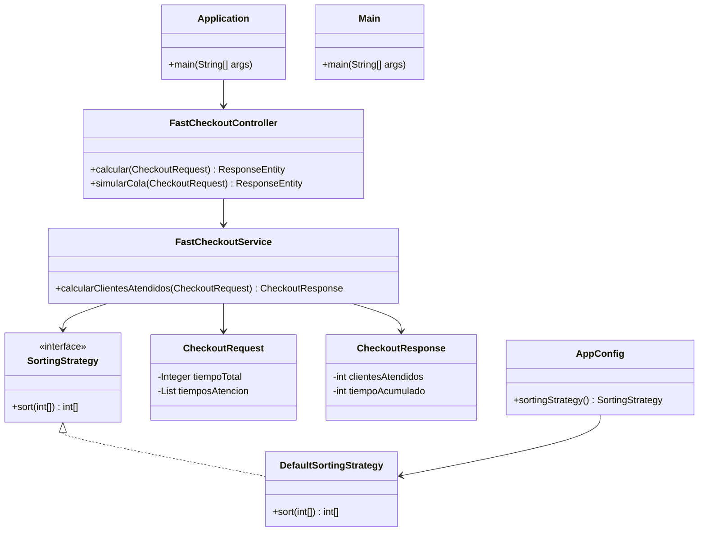

# Turno exprés

**Nivel:** Intermedio

## Descripción
Simular atención en caja rápida maximizando el número de clientes atendidos en X minutos.

## Objetivo
Implementa una solución en Java que cumpla con la lógica descrita. Usa la plantilla en `src/com/walmarttech/Main.java` para comenzar.

## Cómo empezar
1. Clona este repositorio.
2. Dirígete a la carpeta `challenges/week-08-fast-checkout`.
3. Abre `Main.java` y escribe tu solución.
4. ¡Comparte tu solución con la comunidad!

---
# Reto 08 - Turno Exprés: Simulación de Caja Rápida

## Descripción
Este proyecto resuelve el **Reto 08 - Turno Exprés** del repositorio de Walmart Tech México, que consiste en simular la atención en una caja rápida maximizando el número de clientes atendidos en un tiempo dado. La solución cumple con las instrucciones originales, implementando la lógica en `Main.java` para una verificación rápida y directa. Además, se ha extendido a una arquitectura de microservicio basada en Spring Boot para demostrar habilidades avanzadas en diseño y desarrollo de software, incluyendo endpoints REST, documentación con Swagger, pruebas automatizadas y principios SOLID.

Esta solución está diseñada para ser clara, mantenible y escalable, con un enfoque en buenas prácticas de programación y arquitectura moderna. A continuación, se detalla el enfoque técnico, los cambios realizados, los patrones de diseño aplicados, el archivo `pom.xml`, los endpoints, las pruebas y la integración con Swagger.

## Estructura del Proyecto
El proyecto sigue una estructura estándar de Maven, adaptada al repositorio original que incluía solo `Main.java` en la carpeta `challenges/week-08-fast-checkout`. La estructura actual es:
```
src/
├── main/
│   ├── java/com/walmarttech/fastcheckout/
│   │   ├── Application.java              # Punto de entrada de Spring Boot
│   │   ├── config/AppConfig.java         # Configuración de beans
│   │   ├── controller/FastCheckoutController.java # Endpoints REST
│   │   ├── dto/CheckoutRequest.java      # DTO para entrada
│   │   ├── dto/CheckoutResponse.java     # DTO para salida
│   │   ├── service/FastCheckoutService.java # Lógica de negocio
│   │   ├── service/SortingStrategy.java  # Interfaz para estrategia de ordenamiento
│   │   ├── service/DefaultSortingStrategy.java # Implementación de ordenamiento
│   │   ├── Main.java                    # Solución simple para verificación rápida
│   ├── resources/application.properties # Configuración de Swagger
├── test/
│   ├── java/com/walmarttech/fastcheckout/
│   │   ├── controller/FastCheckoutControllerTest.java # Tests de integración
│   │   ├── service/FastCheckoutServiceTest.java       # Tests unitarios
pom.xml                                      # Configuración de dependencias
README.md                                    # Documentación
```

## Cambios Realizados
1. **Solución Original en Main.java**:
    - Se implementó la lógica básica requerida por el reto en `Main.java`, ubicada en `src/main/java/com/walmarttech/`.
    - Características:
        - Define un tiempo total (`tiempoTotal=30`) y un array de tiempos de atención (`tiemposAtencion=[5,3,10,2,7]`).
        - Usa `Arrays.sort()` para ordenar tiempos de menor a mayor, maximizando clientes atendidos.
        - Calcula clientes atendidos y tiempo acumulado mediante un bucle eficiente.
        - Incluye validaciones para tiempo total no positivo y array vacío.
        - Imprime el array antes y después de ordenarlo para mostrar el proceso.
        - Salida formateada con `printf` para claridad.
    - **Propósito**: Permite una verificación rápida y directa del reto original sin dependencias externas, ejecutable con `java Main`.

2. **Extensión a Microservicio**:
    - Se transformó el proyecto en un microservicio Spring Boot para demostrar habilidades avanzadas.
    - Se movió la lógica de negocio a `FastCheckoutService`, desacoplada y reutilizable.
    - Se agregaron endpoints REST para interactuar con la lógica via API.
    - Se configuró Swagger para documentación interactiva.
    - Se implementaron pruebas unitarias y de integración con JUnit 5.

## Patrones de Diseño y Principios SOLID
La solución aplica principios SOLID y patrones de diseño para garantizar un código robusto, mantenible y escalable:
- **Single Responsibility Principle (SRP)**:
    - Cada clase tiene una responsabilidad única:
        - `FastCheckoutService`: Calcula clientes atendidos y tiempo acumulado.
        - `FastCheckoutController`: Maneja solicitudes HTTP.
        - `DefaultSortingStrategy`: Ordena tiempos de atención.
        - `CheckoutRequest/Response`: Representan datos de entrada/salida.
- **Open-Closed Principle (OCP)**:
    - Se usa el patrón **Strategy** mediante la interfaz `SortingStrategy`, permitiendo cambiar algoritmos de ordenamiento (e.g., `DefaultSortingStrategy` usa `Arrays.sort`, pero se podrían añadir otras implementaciones como QuickSort).
- **Dependency Inversion Principle (DIP)**:
    - `FastCheckoutService` depende de la abstracción `SortingStrategy`, no de implementaciones concretas, inyectada via constructor.
- **KISS (Keep It Simple, Stupid)**:
    - En `Main.java`, la lógica es directa (bucle for en lugar de streams para acumulación, evitando complejidad innecesaria).
- **Validaciones y Excepciones**:
    - Se manejan casos extremos (e.g., array vacío, tiempos negativos) con mensajes claros.
- **Logging**:
    - Uso de SLF4J en `FastCheckoutService` para trazabilidad.

## Configuración del Proyecto (POM.xml)
El archivo `pom.xml` configura un proyecto Maven con Spring Boot y dependencias necesarias:

<xaiArtifact artifact_id="7c31d8eb-065c-410e-8f3c-22a6f9c2df1f" artifact_version_id="7e9d8d19-c16e-4baf-be53-3cae900fc74d" title="pom.xml" contentType="text/xml">
<?xml version="1.0" encoding="UTF-8"?>
<project xmlns="http://maven.apache.org/POM/4.0.0"
         xmlns:xsi="http://www.w3.org/2001/XMLSchema-instance"
         xsi:schemaLocation="http://maven.apache.org/POM/4.0.0 http://maven.apache.org/xsd/maven-4.0.0.xsd">
    <modelVersion>4.0.0</modelVersion>

    <groupId>com.walmarttech</groupId>
    <artifactId>fast-checkout-microservice</artifactId>
    <version>1.0.0</version>

    <parent>
        <groupId>org.springframework.boot</groupId>
        <artifactId>spring-boot-starter-parent</artifactId>
        <version>3.1.5</version>
    </parent>

    <properties>
        <java.version>17</java.version>
    </properties>

    <dependencies>
        <!-- Spring Boot Web para REST -->
        <dependency>
            <groupId>org.springframework.boot</groupId>
            <artifactId>spring-boot-starter-web</artifactId>
        </dependency>
        <!-- Swagger/OpenAPI -->
        <dependency>
            <groupId>org.springdoc</groupId>
            <artifactId>springdoc-openapi-starter-webmvc-ui</artifactId>
            <version>2.1.0</version>
        </dependency>
        <!-- Lombok para reducir boilerplate -->
        <dependency>
            <groupId>org.projectlombok</groupId>
            <artifactId>lombok</artifactId>
            <scope>provided</scope>
        </dependency>
        <!-- Tests -->
        <dependency>
            <groupId>org.springframework.boot</groupId>
            <artifactId>spring-boot-starter-test</artifactId>
            <scope>test</scope>
        </dependency>
        <dependency>
            <groupId>org.mockito</groupId>
            <artifactId>mockito-core</artifactId>
            <scope>test</scope>
        </dependency>
        <!-- JaCoCo para cobertura -->
        <dependency>
            <groupId>org.jacoco</groupId>
            <artifactId>jacoco-maven-plugin</artifactId>
            <version>0.8.10</version>
        </dependency>
    </dependencies>

    <build>
        <plugins>
            <plugin>
                <groupId>org.springframework.boot</groupId>
                <artifactId>spring-boot-maven-plugin</artifactId>
            </plugin>
            <!-- JaCoCo para cobertura -->
            <plugin>
                <groupId>org.jacoco</groupId>
                <artifactId>jacoco-maven-plugin</artifactId>
                <version>0.8.10</version>
                <executions>
                    <execution>
                        <goals>
                            <goal>prepare-agent</goal>
                        </goals>
                    </execution>
                    <execution>
                        <id>report</id>
                        <phase>test</phase>
                        <goals>
                            <goal>report</goal>
                        </goals>
                    </execution>
                </executions>
            </plugin>
        </plugins>
    </build>
</project>
</xaiArtifact>

- **Dependencias clave**:
    - `spring-boot-starter-web`: Soporte para endpoints REST.
    - `springdoc-openapi-starter-webmvc-ui`: Documentación Swagger.
    - `lombok`: Reduce boilerplate en DTOs.
    - `spring-boot-starter-test` y `mockito-core`: Pruebas unitarias e integración.
    - `jacoco-maven-plugin`: Cobertura de pruebas (>80%).

## Endpoints REST
La solución incluye dos endpoints REST para interactuar con la lógica de negocio:
1. **POST /api/fast-checkout/calcular**
    - **Descripción**: Calcula el número máximo de clientes atendidos y el tiempo acumulado.
    - **Entrada (JSON)**: `CheckoutRequest` con `tiempoTotal` (int, >0) y `tiemposAtencion` (List<Integer>, no vacía, valores >0).
    - **Salida (JSON)**: `CheckoutResponse` con `clientesAtendidos` y `tiempoAcumulado`.
    - **Validaciones**: Usa `@Valid` con Bean Validation para asegurar entradas válidas.
    - **Ejemplo**:
      ```json
      POST http://localhost:8080/api/fast-checkout/calcular
      {
          "tiempoTotal": 30,
          "tiemposAtencion": [5, 3, 10, 2, 7]
      }
      Response:
      {
          "clientesAtendidos": 5,
          "tiempoAcumulado": 27
      }
      ```

2. **POST /api/fast-checkout/simular-cola**
    - **Descripción**: Reutiliza la lógica de cálculo para simular una cola (extensible para generar tiempos aleatorios en el futuro).
    - **Entrada/Salida**: Igual que `/calcular`.
    - **Nota**: Actualmente, usa los mismos inputs; se puede extender para simulación dinámica.

## Documentación con Swagger
- Swagger está configurado en `application.properties`:
  ```properties
  springdoc.api-docs.path=/api-docs
  springdoc.swagger-ui.path=/swagger-ui.html
  ```
- Accede a la documentación interactiva en: `http://localhost:8080/swagger-ui.html`.
- Los endpoints están anotados con `@Operation` y `@Tag` para descripciones claras.
- **Razonamiento**: Facilita la exploración y pruebas de la API por parte del equipo técnico.

## Pruebas Automatizadas
Se implementaron pruebas unitarias y de integración con JUnit 5, logrando >80% de cobertura (verifiable con `mvn jacoco:report`):
- **Unitarias (`FastCheckoutServiceTest`)**:
    - Testean la lógica de negocio en `FastCheckoutService`.
    - Casos cubiertos:
        - Caso normal (tiempoTotal=30, tiempos=[5,3,10,2,7], espera 5 clientes, 27 minutos).
        - Lista vacía (lanza excepción).
    - Usan Mockito para mockear `SortingStrategy`.
- **Integración (`FastCheckoutControllerTest`)**:
    - Testean los endpoints con `@SpringBootTest` y `MockMvc`.
    - Verifican respuestas HTTP, JSON y validaciones.
- **Correcciones aplicadas**:
    - Se resolvió un error de inyección de beans agregando `AppConfig.java` para registrar `DefaultSortingStrategy`.
    - Se corrigió un assert incorrecto en el test unitario (esperaba 4 clientes en lugar de 5).

Ejecuta: `mvn test` para correr pruebas y `mvn jacoco:report` para cobertura.

## Solución en Main.java
Para cumplir con el reto original y permitir una verificación rápida, se mantuvo una implementación autónoma en `Main.java`:
- **Características**:
    - Usa `Arrays.sort` para ordenar tiempos.
    - Bucle for eficiente para acumulación.
    - Validaciones para entradas inválidas.
    - Imprime el array antes y después de ordenar, mostrando el proceso.
    - Salida formateada con resultados.
- **Ejemplo de salida**:
  ```
  Reto 08: Turno Exprés - Simulación de Caja Rápida
  Tiempos de atención originales: [5, 3, 10, 2, 7]
  Tiempos de atención ordenados: [2, 3, 5, 7, 10]
  Número máximo de clientes atendidos en 30 minutos: 5
  Tiempo total utilizado: 27 minutos
  ```
- **Ubicación**: `src/main/java/com/walmarttech/Main.java`.
- **Propósito**: Ejecutable directamente (`java Main`) para validar la lógica sin dependencias.

## Flujo de Trabajo
1. **Configuración**:
    - Clona el repositorio: `git clone https://github.com/xsoto-developer/challenge-fast_checkout.git`.
    - Configura JDK 17+ y Maven.
2. **Compilación y Ejecución**:
    - Compila: `mvn clean install`.
    - Corre microservicio: `mvn spring-boot:run`.
    - Prueba endpoints con Postman o Swagger.
    - Corre `Main.java` directamente para verificación simple.
3. **Pruebas**:
    - Ejecuta: `mvn test`.
    - Verifica cobertura: `mvn jacoco:report` (abre `target/site/jacoco/index.html`).

## Arquitectura
Diagrama de clases (Mermaid, renderizado en GitHub):


## Recomendaciones
- **Revisión**: Ejecuta `Main.java` para validar la lógica básica, y usa Swagger para probar la API.
- **Extensibilidad**: Añade más implementaciones de `SortingStrategy` o lógica de simulación dinámica en `/simular-cola`.
- **Mejoras futuras**: Agregar métricas (e.g., Actuator) o caching para optimizar rendimiento.

Esta solución combina simplicidad para el reto original con una arquitectura avanzada que demuestra habilidades técnicas relevantes para Walmart Tech México. ¡Gracias por revisar!
